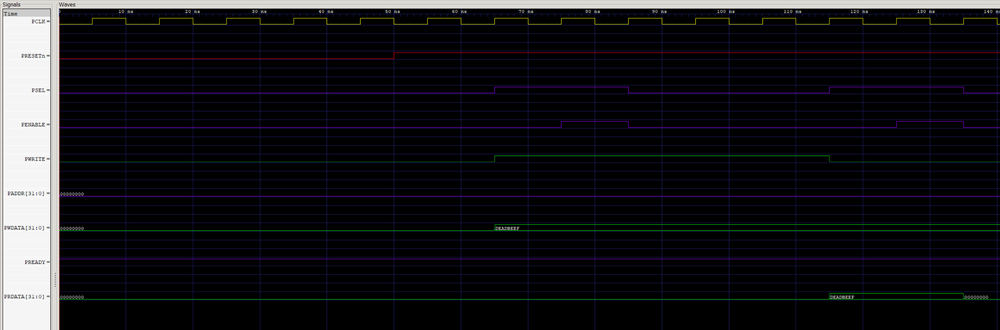

# FSM-Based AMBA APB Master & Slave Interface

## 1. Introduction
This project implements a robust **AMBA APB (Advanced Peripheral Bus)** Master and Slave communication system using SystemVerilog. The design focuses on a low-power, low-bandwidth control interface suitable for configuring registers in System-on-Chip (SoC) designs.

The core logic is driven by a **Finite State Machine (FSM)** that strictly adheres to the APB protocol phases (IDLE, SETUP, ACCESS), ensuring clean timing and reliable data transfer between the system controller and peripheral devices.

## 2. Key Features
* **FSM-Based Control:** The Master utilizes a dedicated 3-state FSM to manage bus timing and handshake signals automatically.
* **Configurable Transactions:** Supports both **Read** and **Write** operations triggered by a simple 2-bit multiplexer control signal.
* **Zero-Wait Slave:** The included Slave module implements a fast, zero-wait state response (`PREADY` tied high) for immediate data access.
* **32-bit Architecture:** Full 32-bit address and data paths for standard register configuration.
* **Synchronous Design:** All internal registers and state transitions are synchronized to the rising edge of `PCLK`, with asynchronous active-low reset.

## 3. Architecture Overview
The system is divided into two main modules connected via the standard APB interface signals.

### 3.1 APB Master (Controller)
The Master acts as the bridge between the high-level system logic and the APB bus. It translates simple commands into the precise APB protocol timing:
1.  **IDLE State:** Waits for a transaction request (`mux` input).
2.  **SETUP Phase:** Drives the Address (`PADDR`) and Selection (`PSEL`) signals. This phase lasts exactly one clock cycle.
3.  **ACCESS Phase:** Asserts `PENABLE` to validate the transfer. It waits for the Slave's `PREADY` signal before completing the transaction and latching data (for reads) or finishing the write.

### 3.2 APB Slave (Peripheral)
The Slave implements a simple 4x32-bit register file:
* **Write Operations:** Data is written to the internal register array on the rising edge of `PCLK` when `PSEL`, `PENABLE`, and `PWRITE` are active.
* **Read Operations:** Data is driven asynchronously (combinational logic) onto `PRDATA` whenever the device is selected and `PWRITE` is low.

## 4. Interface Description
The module interacts with the host system on one side and the APB bus on the other. All operations are synchronized to the rising edge of the clock.

| Signal Group | Signal Name | Direction | Width | Description |
| :--- | :--- | :--- | :--- | :--- |
| **Global** | `PCLK` | Input | 1-bit | **System Clock**. All logic triggers on the rising edge. |
| | `PRESETn` | Input | 1-bit | **Active-Low Reset**. Asynchronous reset to initialize FSM and registers. |
| **System Interface** | `mux` | Input | 2-bit | **Operation Select**. Controls the transaction type:<br>`00`: IDLE (No op)<br>`01`: READ transaction<br>`11`: WRITE transaction |
| | `addr_in` | Input | 32-bit | **Address Input**. Target address provided by the system. |
| | `wdata_in` | Input | 32-bit | **Write Data Input**. Payload to be written to the slave (valid when `mux=11`). |
| **APB Bus** | `PADDR` | Output | 32-bit | **APB Address**. Driven to the peripheral during SETUP/ACCESS. |
| | `PSEL` | Output | 1-bit | **Slave Select**. Asserted to indicate a transaction start. |
| | `PENABLE` | Output | 1-bit | **Enable**. Asserted during the ACCESS phase to validate the transfer. |
| | `PWRITE` | Output | 1-bit | **Transfer Direction**. `1` = Write, `0` = Read. |
| | `PWDATA` | Output | 32-bit | **APB Write Data**. Driven by Master during write cycles. |
| | `PRDATA` | Input | 32-bit | **APB Read Data**. Incoming data from the Slave. |
| | `PREADY` | Input | 1-bit | **Ready Handshake**. Slave signal to extend the transfer (Wait states). |

## 5. Verification
The system is designed to be verified using a loopback testbench where the Master writes data to the Slave and reads it back.

### Functional Flow Verified:
1.  **Write Transaction:**
    * System sets `mux=11` and provides data/address.
    * Master FSM transitions `IDLE -> SETUP -> ACCESS`.
    * Slave detects write command and updates internal register at `addr_in`.
2.  **Read Transaction:**
    * System sets `mux=01`.
    * Master FSM transitions `IDLE -> SETUP -> ACCESS`.
    * Slave drives data from the requested register onto `PRDATA`.
    * Master latches `PRDATA` into internal `rdata_reg` when `PREADY` is high.

### Simulation Waveform Snapshot
The waveform below captures the simulation results. It demonstrates a successful **Write** transaction followed by a **Read** verification to ensure data integrity.



**Analysis of Results:**
The simulation validates the FSM correctness through two key transactions:

1.  **Write Transaction (Left Side):**
    * The Master asserts `PSEL` and drives `PWRITE` **HIGH**, indicating a write operation.
    * The payload `0xDEADBEEF` is driven onto the `PWDATA` bus.
    * When `PENABLE` goes high, the Slave captures the data.

2.  **Read Transaction (Right Side):**
    * The Master asserts `PSEL` again but drives `PWRITE` **LOW**, indicating a read operation.
    * The Slave responds by driving the previously stored value, `0xDEADBEEF`, onto the `PRDATA` bus.
    * The simulation proves that the data was correctly stored in the Slave and retrieved by the Master without data loss or timing violations.

## 6. File Description
* `apb_master.sv`: The FSM-based Master controller RTL.
* `apb_slave_simple.sv`: A reference Slave module with 4 internal registers.

## 7. Tools Used
* **Language:** SystemVerilog
* **Simulation:** Icarus Verilog / ModelSim / Vivado Simulator
* **Waveform Analysis:** GTKWave / Vivado Logic Analyzer

## 8. How to Run Simulation
To compile and simulate the design (assuming a testbench `tb_apb.sv` exists):

```bash
# 1. Compile the design
iverilog -g2012 -o apb_sim apb_master.sv apb_slave_simple.sv tb_apb.sv

# 2. Run the simulation
vvp apb_sim

# 3. View Waveforms
gtkwave waves.vcd